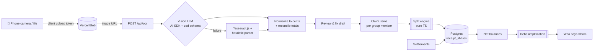

# 🧾 Receipt Split

**Snap the receipt. Tap what you had. Split tax and tip fairly, down to the cent.**

Receipt Split turns a photo of a restaurant receipt into structured line items, lets everyone at the table claim what they ordered, and computes a fair split with tax and tip shared in proportion to what each person actually ate. Groups keep a running history and a simplified "who owes whom" list, so settling up takes the fewest possible payments.

[](https://github.com/keix40/receipt-split/actions/workflows/ci.yml)


> **Live demo:** _coming soon_ (will be deployed on Vercel)

---

## Screenshots

> 📸 **PLACEHOLDER: add real screenshots before publishing.**
>
> | Scan | Review items | Claim & split | Group balances |
> | --- | --- | --- | --- |
> | `docs/screenshots/scan.png` | `docs/screenshots/review.png` | `docs/screenshots/split.png` | `docs/screenshots/balances.png` |

---

## Features

- **📷 Receipt OCR with structured output.** A vision LLM (through the Vercel AI SDK) returns line items, quantities, tax, tip, service charges and totals, validated against a zod schema. If the model call fails, it falls back to Tesseract.js plus a heuristic parser.
- **🔍 Numbers are checked, not trusted.** Line items are compared with the subtotal, and subtotal + tax + tip + fees with the total. Anything that doesn't add up is shown to you to fix; nothing gets "corrected" behind your back.
- **👆 Tap to claim.** Everyone taps the items they had. Shared dishes split evenly, or by portions (e.g. 2 of 3 dumplings).
- **⚖️ Fair, exact split.** Tax, tip and fees are divided in proportion to each person's subtotal. Largest-remainder rounding means the shares always add up to the receipt total, with no lost or extra cents.
- **👥 Groups & running balances.** Finalized receipts and repayments feed a ledger. Guests can join without an account.
- **🔁 Debt simplification.** Net balances become a short list of transfers (at most _n − 1_ payments for _n_ people with a balance).
- **🌍 Currency-aware.** Amounts are stored as integer minor units, and the number of decimals comes from the ISO 4217 code (USD has 2, JPY has 0).

## Tech Stack

| Layer | Choice |
| --- | --- |
| Framework | Next.js 16 (App Router, React 19, Turbopack) + TypeScript (strict) |
| Hosting | Vercel (app, API routes, Blob); Render as an alternative Postgres host |
| Database | Postgres (Neon or Render Postgres) via **Drizzle ORM** + drizzle-kit migrations |
| OCR | Vercel AI SDK `generateText` + `Output.object()` (zod schema) through Vercel AI Gateway; Tesseract.js fallback |
| Storage | Vercel Blob (direct client uploads) |
| Validation | Zod 4 (shared by API input, LLM output and forms) |
| UI | Tailwind CSS v4 + shadcn/ui |
| Auth (planned) | Better Auth (email magic link + OAuth) |
| Testing | Vitest (unit/property tests), Playwright (e2e) |
| CI | GitHub Actions: lint, typecheck, test |

## Architecture



The split engine (`src/lib/split`) is pure TypeScript with no I/O. It takes items, claims and adjustments and returns per-person amounts, which makes it easy to test exhaustively. When a receipt is finalized, its result is stored as an immutable snapshot (`receipt_shares`), so later changes to the algorithm never rewrite history.

### How the split works

1. **Items.** Each item's total is divided among the people who claimed it, weighted by portions.
2. **Subtotals.** Each person's item shares are summed.
3. **Tax, tip, fees, discounts.** Each is divided in proportion to the subtotals (or equally, for flat fees).
4. **Rounding.** Every division uses the largest-remainder method: everyone gets the floor of their exact share, then leftover cents go to the largest fractional remainders, with ties broken by participant order. As a result, shares always sum to the exact total, and each share is within one cent of its exact value.
5. **Balances.** For each receipt, the payer is credited and each diner is debited; settlements move money back. A greedy pass then matches the largest debtor with the largest creditor until everyone is at zero.

## Getting Started

### Prerequisites

- Node.js **22.12+** (required by Vitest 5 and AI SDK 7)
- A Postgres database: [Neon](https://neon.tech) (free tier, also available through the Vercel Marketplace) or [Render Postgres](https://render.com/docs/postgresql)
- A Vercel account for Blob storage and the AI Gateway

### Setup

```bash
git clone https://github.com/keix40/receipt-split.git
cd receipt-split
npm install
cp .env.example .env.local      # then fill in the values
npm run db:push                 # create tables (use db:generate + db:migrate for real migrations)
npm run dev                     # http://localhost:3000
```

If the repo is linked to a Vercel project, `vercel env pull .env.local` fetches the environment variables for you.

## Environment Variables

| Variable | Required | Description |
| --- | --- | --- |
| `DATABASE_URL` | ✅ | Postgres connection string (pooled, for Neon) |
| `DATABASE_URL_UNPOOLED` | – | Direct connection for migrations; falls back to `DATABASE_URL` |
| `BLOB_READ_WRITE_TOKEN` | ✅ | Vercel Blob token; added automatically when you connect a Blob store |
| `AI_GATEWAY_API_KEY` | local only | AI Gateway key for local dev. Vercel deployments use OIDC automatically |
| `OCR_MODEL` | ✅ | Vision-capable model id in `provider/model` form, from the AI Gateway model list |
| `OCR_FALLBACK` | – | Set to `tesseract` to enable the offline fallback |
| `BETTER_AUTH_SECRET`, `BETTER_AUTH_URL` | planned | Needed once auth lands (milestone 2) |

## Scripts

| Script | What it does |
| --- | --- |
| `npm run dev` | Start the dev server |
| `npm run build` / `npm start` | Production build / serve |
| `npm run lint` | ESLint (Next.js core-web-vitals + TypeScript rules) |
| `npm run typecheck` | `tsc --noEmit` using the TypeScript 7 native compiler |
| `npm test` | Vitest unit and property tests |
| `npm run test:watch` | Vitest in watch mode |
| `npm run test:coverage` | Unit tests with coverage (install `@vitest/coverage-v8` first) |
| `npm run test:e2e` | Playwright e2e tests (run `npx playwright install` once) |
| `npm run db:generate` / `db:migrate` / `db:push` / `db:studio` | Drizzle Kit |

> **TypeScript note:** TypeScript 7 doesn't ship a programmatic API yet, so `typescript` is aliased to `@typescript/typescript6` for tools that need one (Next.js, typescript-eslint). `tsc` runs TS 7 through the `@typescript/native` alias. This follows the side-by-side setup recommended in the TypeScript 7 release notes.

## Testing

The split engine and OCR post-processing have unit tests, including seeded property tests that check the invariants on hundreds of random receipts:

- The parts of any allocation sum exactly to the total, and each is within 1 cent of its exact share.
- The per-person totals of a split always equal items + tax + tip + fees − discounts.
- Debt simplification settles every balance to zero, with at most _n − 1_ positive transfers.

```bash
npm test          # unit
npm run test:e2e  # end-to-end (starts the dev server)
```

## Deployment (Vercel)

1. Push the repo to GitHub and **import it in Vercel** (framework preset: Next.js).
2. **Storage → Blob:** create a store and connect it to the project (this sets `BLOB_READ_WRITE_TOKEN`).
3. **Database:** add Neon from the Vercel Marketplace (this sets `DATABASE_URL`), or create a Render Postgres instance and paste its *external* connection string.
4. **AI Gateway:** enable it for the team and set `OCR_MODEL`. Deployments authenticate with OIDC, so no API key is needed there.
5. Run migrations against production: `DATABASE_URL=... npm run db:migrate`.
6. Deploy. Every pull request gets a preview deployment. With Neon, you can also give each preview its own database branch.

> The Blob `onUploadCompleted` callback can't reach `localhost`. Use a tunnel (e.g. ngrok) if you need it locally.

## Roadmap

- [x] **M0: Foundation.** Next.js + TS scaffold, Drizzle schema, split engine with tests, CI
- [x] **M1: Scan.** Blob upload, vision OCR with zod schema, Tesseract fallback, reconciliation checks
- [ ] **M2: Accounts & groups.** Better Auth, groups, guest members, persist receipts and drafts
- [ ] **M3: Claim & split.** Editable draft, tap-to-claim (portions), live split preview, finalize to `receipt_shares`
- [ ] **M4: Balances.** Group ledger, record settlements, simplified who-owes-whom, history
- [ ] **M5: Polish.** Share links for guests, real-time claiming, PWA/offline, rate limiting, i18n and multi-currency groups
- [ ] **M6: Launch.** Screenshots, demo video, OCR accuracy eval set, write-up

## License

[MIT](./LICENSE) © 2026 Kei ([@keix40](https://github.com/keix40))
